# Project 2 Cloud - Infrastructure Deployment

* **Sara Beleid Elhoti**: 4939
* **Fatima Alzahraa Mohammed**: 4999
* **Tasneem Khaled Aldernawi**: 4890

## 2. Project Title and Description
* **Project Title:** Cloud Infrastructure Deployment with Terraform, Docker, and GitHub Actions*
* **Project Description:** This project automates the deployment of a containerized web application to Microsoft Azure using Infrastructure as Code (IaC). The system provisions a complete Azure environment including a Virtual Network, Subnet, Public IP, Network Security Group, and a Linux Virtual Machine. A Docker container running an Nginx web server is automatically deployed and configured to restart always. The entire process is automated using Terraform and GitHub Actions CI/CD pipeline.

## 3. Architecture Diagram

```mermaid
flowchart TD
    %% 1. CI/CD & Image Registry Enclosure (On Top)
    subgraph Pipeline [1. CI/CD Engine & Image Registry]
        A[GitHub Repository <br> <i>Main Branch</i>] --> B(GitHub Actions: terraform plan)
        A --> C(GitHub Actions: Manual Approval Gate)
        C --> D(GitHub Actions: terraform apply)
        E[Docker Hub <br> <i>Public Image Registry</i>]
    end

    %% 2. Azure Cloud Infrastructure Enclosure (Below Pipeline)
    subgraph Azure [2. Microsoft Azure Cloud Infrastructure]
        subgraph RG [Resource Group: cloudscale-tasneem-sara-fatima-rg]
            
            %% Combined network layer with completely safe formatting text labels
            subgraph Network [Virtual Network: 10.0.0.0/16 --> Subnet: 10.0.1.0/24]
                F[Network Security Group <br> <i>Allow SSH Port 22 & HTTP Port 80</i>]
                G[Static Public IP <br> <i>Static Allocation</i>]
                H[Network Interface <br> <i>NIC Attached to VM & Public IP</i>]
                
                F --> H
                G --> H
            end

            %% Compute Element
            H --> I[Linux Virtual Machine <br> <i>Size: Standard_B1s &#124; OS: Ubuntu 22.04</i>]

            %% Automated VM Post-Boot Configuration with pure actions
            subgraph VM_Script [3. VM Custom Script Execution]
                I --> J[Install Docker on the VM]
                J --> K[Pull Docker Image from Docker Hub]
                K --> L[Run Container with Port Mapping <br> <i>-p 80:80</i>]
                L --> M[Ensure Container Restarts Automatically <br> <i>--restart always</i>]
            end
        end
    end

    %% Pipeline triggering cloud deployment using GitHub Secrets
    D -->|Deploy via GitHub Secrets| RG
    
    %% Dependency Image Pull Connection
    E -.->|Pulls App Container| K
```


## 4. Docker Image Build and Push Instructions

To containerize the application, a Docker image was built using the provided Dockerfile. The image was created locally with Docker and tagged with the appropriate repository name.

After verifying that the image was built successfully, it was pushed to Docker Hub to make it available for deployment. The following commands were used:

```bash id="a1k9p3"
docker build -t sackora/team-webapp:latest .
docker push sackora/team-webapp:latest
```

The uploaded image can then be pulled from Docker Hub and used by deployment services or virtual machines to run the application in a consistent environment.


## 5. Terraform Setup Instructions

### Prerequisites
- Azure subscription
- Terraform installed locally
- Azure CLI installed

### Terraform Files Created
| `providers.tf` | Configures Azure provider and backend |
| `variables.tf` | Input variables (location, team_name, vm_size, docker_image, ssh_public_key) |
| `outputs.tf` | Output values (resource_group_name, public_ip_address, virtual_machine_id) |
| `main.tf` | Main infrastructure resources |

### Resources Provisioned

1. **Resource Group** - `FatimaTasneemSara-rg`
2. **Virtual Network** - `FatimaTasneemSara-vnet` (10.0.0.0/16)
3. **Subnet** - `internal-subnet` (10.0.1.0/24)
4. **Public IP** - Static IP for VM access
5. **Network Security Group** - Allows SSH (port 22) and HTTP (port 80)
6. **Network Interface** - Connects VM to VNet
7. **Linux VM** - Ubuntu 22.04 LTS (Standard_B2s_v2)
8. **Custom Script Extension** - Installs Docker and runs the container with `--restart always`

### Variables
| `location` | Azure region | Sweden Central |
| `team_name` | Team identifier | FatimaTasneemSara |
| `vm_size` | VM size | Standard_B2s_v2 |
| `docker_image` | Docker Hub image | sackora/team-webapp:v1 |
| `ssh_public_key` | SSH public key | (your key here) |

### How to Deploy

```bash
# Initialize Terraform
terraform init

# Preview changes
terraform plan

# Deploy infrastructure
terraform apply -auto-approve

# Get the public IP
terraform output public_ip_address

# Destroy everything
terraform destroy -auto-approve
```

## GitHub Actions Workflow Explanation

Our CI/CD pipeline is designed around a strict production-grade workflow. It separates testing from deployment using a two-stage branch lifecycle model. This ensures that no infrastructure changes are made blindly without verification and proper authorization.

### Pipeline Triggers 
The workflow is completely automated and listens for two events on our repository:
1. **Pull Requests to `main`:** Triggered when a team member opens a PR to merge new infrastructure configurations.
2. **Pushes to `main`:** Triggered automatically when a Pull Request is approved and merged into the production branch.

---

### Inside the Pipeline: The Two Core Jobs

#### 1. The Verification Phase (`terraform-plan`)
* **When it runs:** Only during a **Pull Request**.
* **What it does:** It spins up a fresh Ubuntu runner, authenticates securely with Azure using our saved GitHub Secrets, initializes the backend, and runs `terraform plan`.
* **The Goal:** This provides a safe, isolated dry-run. It generates a detailed preview log showing exactly what resources will be added, modified, or destroyed, *before* anything is actually built in our live cloud environment.

#### 2. The Deployment Phase (`terraform-apply`)
* **When it runs:** Only when code is directly **pushed or merged into `main`**.
* **What it does:** It targets our protected `production` deployment environment. This activates an automated security gate that freezes the pipeline run and sends a notification to our team for review. 
* **The Goal:** Once a reviewer clicks the **Approve** button, the pipeline unlocks, runs `terraform apply -auto-approve`, maps out our live infrastructure network, installs Docker, and spins up our web application container.

